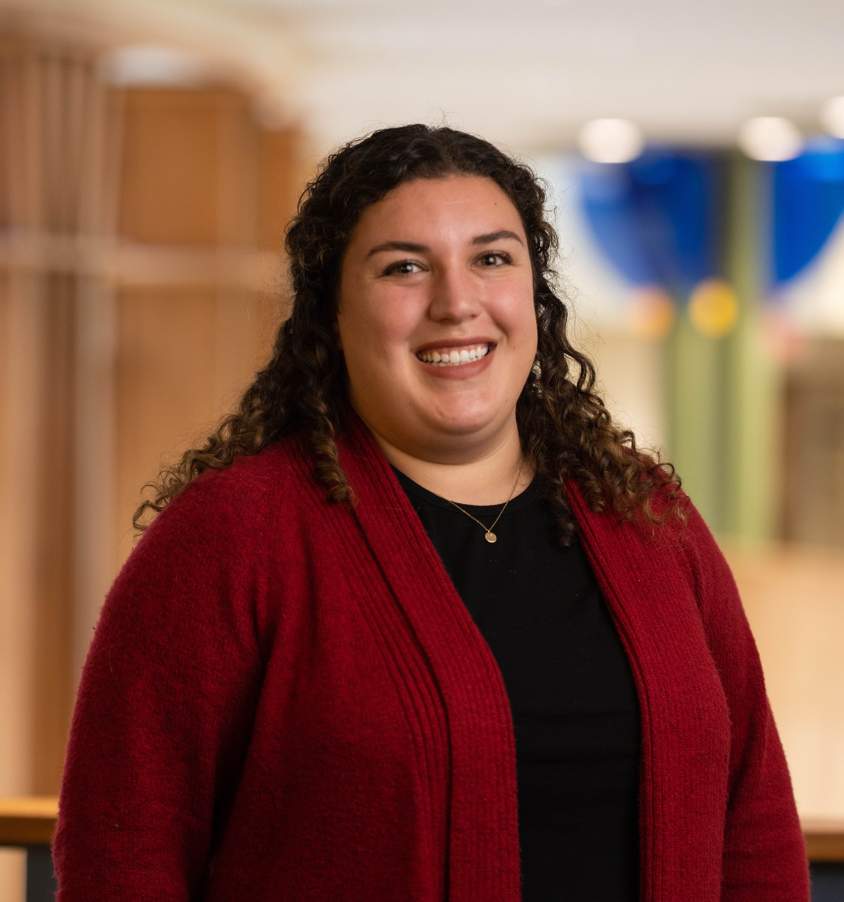

## Instructor: Nicole (Nicky) Wakim, PhD

:::::: columns
::: {.column width="68%"}
-   **Email:** [wakim\@ohsu.edu](mailto:wakim@ohsu.edu)

-   **Office:** VPT 622A

**Pronouns:** she/her/hers

*You are welcome to address me as Nicky (pronounced "nik-EE"), Dr. Wakim
(pronounced "wah-KEEM"), Dr. W, Dr. Nicky, Professor, Professor Wakim,
or any combination of the prior.*

**Best method to contact:** Office hours or Slack for general course
questions or E-mail/Calendly appointments for private communication.
:::

::: {.column width="2%"}
:::

::: {.column width="30%"}
{fig-align="right" width="256"}
:::
::::::

**Brief professor statement:** As a professor, my main goal is to
instill a growth mindset into my students. Growth mindset means we are
NOT stuck in our abilities or knowledge, and that we all can and will
grow! This course aims to be as transparent as possible. I want you to
understand my motivation for assessments, questions, and lessons. I also
want those assessments to be clear, so please ask for clarification
whenever needed.

### Office Hours

Nicky's office hours will follow Wednesday class time.

-   Wednesdays 3-4pm at RLSB 3A001
-   No virtual option

## Teaching Assistants

Sheetal Akula, Kelsey Mackenzie, and Sophia Mann will serve as our TAs
for the quarter!! They will have the following office hours and will
help answer questions over email.

| TA | Email | Day | Time | Location |
|---------------|---------------|---------------|---------------|---------------|
| Sheetal Akula | [akula\@ohsu.edu](mailto:akula@ohsu.edu){.email} | Friday | 12-1pm | TBD |
| Kelsey Mackenzie | [mackenzie\@ohsu.edu](mailto:mackenzie@ohsu.edu){.email} | Thursday | 3:30-4:30pm | [Zoom](https://pdx.zoom.us/j/88514661813) |
| Sophia Mann | [mannso\@ohsu.edu](mailto:mannso@ohsu.edu){.email} | Tuesday | 10:30-11:30am | TBD |

## Academic Success Center Tutors

The Academic Success Center has biostatistics/epidemiology tutors
available. Unlike TAs, tutors are not closely associated with any
particular course sections or professors, nor do they have any grading
responsibilities. Consider meeting with a tutor when you feel stuck on a
project, need help with R coding, want to review course concepts, or
simply complete assignments in a social learning environment. There is
no cost to use tutoring.

**Your tutor this year is Charles Parker** He is looking forward to
working with you in a one-to-one or group setting, depending on your
needs. Please schedule to meet with them at least 24 hours in advance.
If you have questions about tutoring or need assistance with the
schedule, contact one of the tutors or the Academic Success Center:
[parkecha\@ohsu.edu](mailto:parkecha@ohsu.edu){.email} or
[learningsupport\@ohsu.edu](mailto:learningsupport@ohsu.edu){.email}

## My scope of practice

If you are interested in what I consider my Scope of Practice, here is
an adapted table from Dr. Costa's [An Educator’s Scope of
Practice](http://dx.doi.org/10.1007/978-3-030-92705-9_15):

| What I do | What I do not do |
|------------------------------------|------------------------------------|
| Create positive learning conditions for all learners | Police my students’ attention |
| Create assessments that accommodate all students' learning styles | Focus on eliminating any opportunity for cheating |
| Consistently maintain expertise in my subject matter area | Ignore recent updates in my subject matter area |
| Know and apply work in pedagogy and learning sciences | Focus only on subject matter expertise |
| Empathy | Counseling |
| Work to dismantle racism, sexism, and oppression in all forms, apply DEI principles | Ignore equity concerns |
| Recognize the probability of trauma in my classroom | Try to assess individual trauma histories |
| Develop self-awareness and cultural humility | Overly focus on behaviors or culture of others |
| Recognize and respond to impact of trauma on learning | Rigidity or over-reliance on what worked for me (or others in past) as a learner |
| Refer you to resources in school, city, local government | Ignore your concerns nor tell you it's “not my problem” |
| Scaffold work in the course to gradually build knowledge | Eliminate all struggle while learning |
