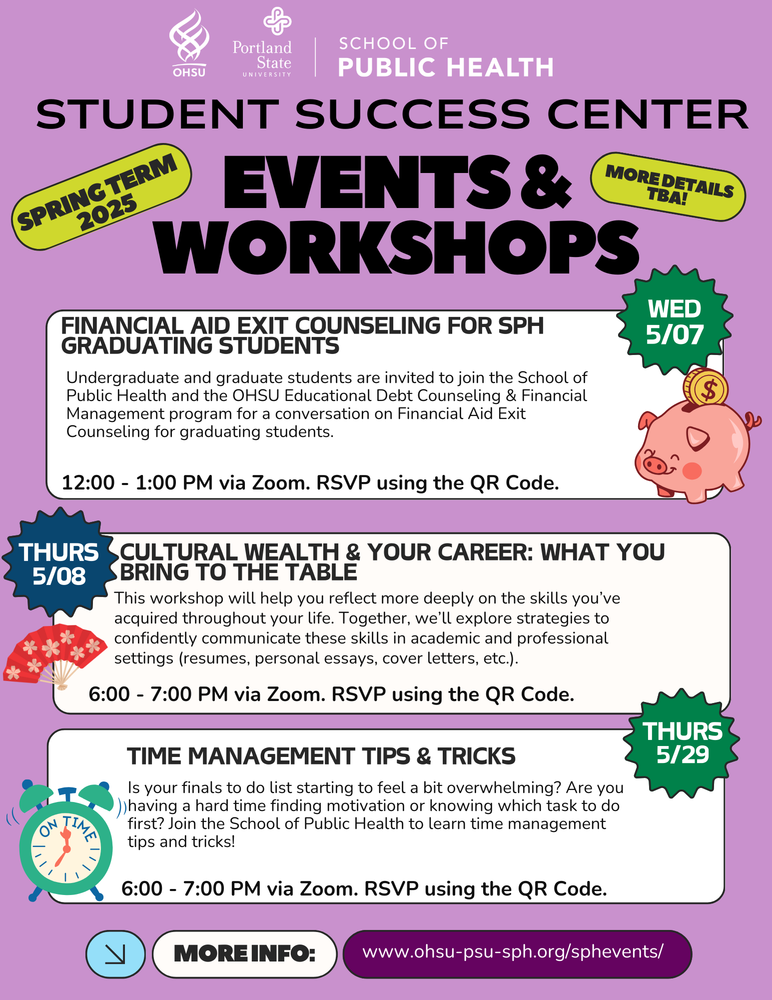

## Announcements

- Monday (5/12) is another required in-person attendance day!! 
  - Email me if you have extenuating circumstances
- HW 2
  - For the model with LOC, make sure you are creating the indicator for LOC categories! $$\text{logit} \left(\pi(LOC)\right)=\beta_0 + \beta_1 \times I(LOC =\text{``Deep Stupor"}) + \beta_2 \times I(LOC =\text{``Coma"})$$
- Nicky will be out of office from 5/8-5/12
  - Will not be responding to emails
- R conference in Portland!! **on 6/20-6/21** <https://cascadiarconf.com/>
  - $33.85 for in-person on 6/21
  - $12.85 for virtual (only on 6/21)
  - Each workshop on 6/20 is $33.85
    - Here are some that may be of interest:
      - [Intro to Git for R users](https://cascadiarconf.com/2025/workshop/github1/)
      - [Intro to GIS and Mapping in R](https://cascadiarconf.com/2025/workshop/gis/)
  - If you want to attend but money is an issue, please talk to/email me! 
    - There are resources at SPH that we can apply for

- More events at SPH through the Student Success Center 

### Recurring 

- The Academic Success Center is hiring peer tutors for AY '25-'26! 
  - Subject areas of interest include 
    - Pharmacy
    - Biostatistics
    - NCLEX prep
    - Math (dosage calculations, etc.)
    - Dentistry (esp. dental anatomy)  
  - Tutoring is a great way to solidify your own content knowledge, get teaching-adjacent experience for your resume, and give back to the student community. [Apply in OHSU Jobs](https://externalcareers-ohsu.icims.com/jobs/28153/peer-tutor/job?hub=6&_gl=1*1kmkhsc*_ga*NjAwNTQyMi4xNzM5MjMwNTQz*_ga_5Y2BYGL910*MTc0NDY1NzA4MC44LjEuMTc0NDY1NzA5MS40OS4wLjA.&mobile=false&width=1252&height=500&bga=true&needsRedirect=false&jan1offset=-480&jun1offset=-420) or email Morgan Gross (grossmo@ohsu.edu), ASC Tutoring Program Coordinator, for more info! 
- Adri Jones and Student Success Center will be hosting more Community & Chat events (IYKYK) in Vanport 620M for the following dates from 11:00 AM-12:30 PM:
  - May 21 
  - June 4
  - June 18
  - IYKYK = "if you known you know"

## Key Dates

- Lab 3 due 5/9
- Quiz 2 open on 5/14
  - Will cover Lessons 6-9
- Homework 3 due 5/16

## Last class

- We went over Numeric problems: zero cell count, complete separation, and multicollinearity
- Some of the ways to address these will be helpful in your labs!!

