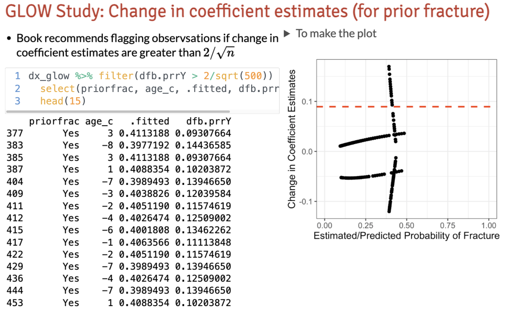

## Muddy Points from Spring 2026

### 1. Interpretations of standardized deviance residuals, Cook's distance, etc. Esp what those plots are saying

The plots are more to visualize the cutoffs and look at patterns in the data. Patterns are okay!

In the plots, I'm usually looking for jumps between data. Is there a single data point or a separate group of data points that exceed the cutoff and don't follow the patterns from the rest of the data? If so, then we may have an influential point that is affecting our model fit. If there are no jumps and the data points are following the same pattern, then we likely don't have any influential points.

### 2. Confused about what is going on in the plot for the change in coefficient estimates on slide 19 of lesson 13.

This is the slide: 

Haha yeah, the patterns are odd. If we think about the data, each individual can have a fracture (yes/no), have a prior fracture (yes/no), and are a certain age. For the first two variables, there are four potential combinations between prior fracture and fracture (yes/yes, yes/no, no/yes, no/no). These four combinations are represented by the four lines-ish on the plot. Each combination has many different ages, leading to the lines-ish that we see. If all combinations had the same age, we'd only see 4 dots. 

The people who are above the cutoff seem to all have a prior fracture and a centered age below 3. If we take any of these people out of the model, the coefficient estimate for prior fracture changes a lot. This means that these people are influential points that are affecting the model fit. However, their observed values are not extreme, so even though they are influential, they are an issue in the model. 

## Muddy Points from Spring 2025

### Just reminding myself with model selection what residuals are meant to represent?

### Can you restate the info from the " Diagnostics of Logistic regression" slide? A change in residuals if a covariate is excluded, if the model is better then it means the covariate pattern is bad. What do we do with the covariate pattern then? Doesn’t it have to stay in our analysis? Or would we take out smoking (Y/N) on future bone fracture (Y/N) and replace smoking with fiber intake above 50 g a day (Y/N) alongside future bone fracture (Y/N).

### 

## Muddy Points from Spring 2024

### 1. How did you determine the ages for the R output on slide 24 (standardized deviance residuals)

The centered ages are centered around the mean age. A few classes ago I mentioned that the mean was 69 years old, might have gotten lost in this lesson. So calculating the actual ages is just adding the mean age and centered age. So centered age of 6 is 69+6 = 75. Also, very confusing because apparently I can't add!

