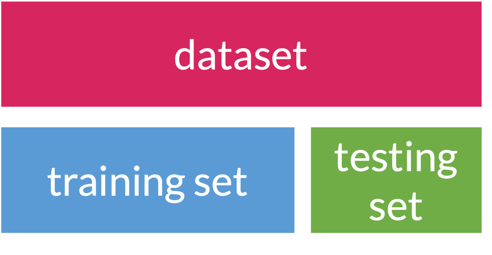
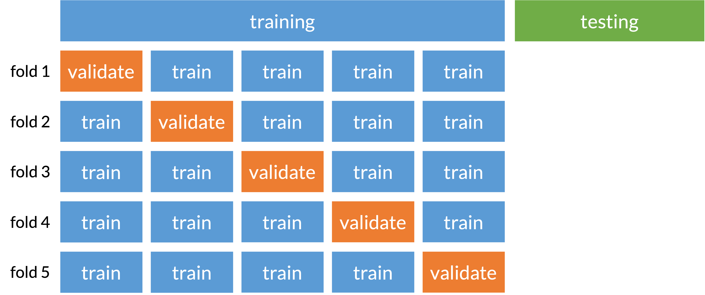

```{r}
#| echo: false
#| warning: false
#| message: false

library(gt)
library(gtsummary)
library(tidyverse)
library(tidymodels)
library(tidytext)
#library(textrecipes)
library(here)
library(aplore3)
library(openintro)
library(patchwork)
library(skimr)

theme_set(theme_minimal())


mean_age = mean(glow500$age) %>% round()
glow1 = glow500 %>% mutate(age_c = age - mean_age)

set.seed(513613)
```

# Learning Objectives

1.  Understand the place of LASSO regression within association and prediction modeling for binary outcomes.

2.  Understand how penalized regression is a form of model/variable selection.

3.  Set up prediction model building steps and split data into training and testing sets. 

4.  Perform LASSO regression on a dataset using R and the general process for classification methods.

# Learning Objectives

::: lob
1.  Understand the place of LASSO regression within association and prediction modeling for binary outcomes.
:::

2.  Understand how penalized regression is a form of model/variable selection.

3.  Set up prediction model building steps and split data into training and testing sets. 

4.  Perform LASSO regression on a dataset using R and the general process for classification methods.

## Some important definitions

-   [**Model selection**]{style="color:#4472C4;"}: picking the "best" model from a set of possible models

    -   Models will have the same outcome, but typically differ by the covariates that are included, their transformations, and their interactions

    -   "Best" model is defined by the research question and by how you want to answer it!

 

-   [**Model selection strategies**]{style="color:#D6295E;"}: a process or framework that helps us pick our "best" model

    -   These strategies often differ by the approach and criteria used to the determine the "best" model

 

-   [**Overfitting**]{style="color:#70AD47;"}: result of fitting a model so closely to our *particular* sample data that it cannot be generalized to other samples (or the population)

## Bias-variance trade off

::::: columns
::: {.column width="55%"}
-   Recall from 512/612: MSE can be written as a function of the bias and variance

    $$
    MSE = \text{bias}\big(\widehat\beta\big)^2 + \text{variance}\big(\widehat\beta\big)
    $$

-   **No longer use MSE in logistic regression, BUT the idea between the bias and variance trade off holds!**

-   For the same data, if our model has...

    -   More covariates: less bias, more variance of coef. estimates

        -   Potential overfitting: with new data does our model still hold?

    -   Less covariates: more bias, less variance of coef. estimates

        -   More bias bc more likely that were are not capturing the true underlying relationship with less variables
:::

::: {.column width="45%"}
[{width="1000"}](http://scott.fortmann-roe.com/docs/BiasVariance.html)

::: box2
Think of it as a balance between **flexibility** and **stability** of our model
:::
:::
:::::

## Visual of overfitting and underfitting data

From [Data Science in a Box](https://datasciencebox.org/course-materials/_slides/u4-d07-prediction-overfitting/u4-d07-prediction-overfitting#9):

```{r echo=FALSE, out.width="70%", warning = FALSE}
lm_fit <- linear_reg() %>%
  set_engine("lm") %>%
  fit(y4 ~ x2, data = association)

loess_fit <- loess(y4 ~ x2, data = association)

loess_overfit <- loess(y4 ~ x2, span = 0.05, data = association)

association2 = association %>%
  dplyr::select(x2, y4) %>%
  mutate(
    Underfit = augment(lm_fit$fit) %>% dplyr::select(.fitted) %>% pull(),
    OK       = augment(loess_fit) %>% dplyr::select(.fitted) %>% pull(),
    Overfit  = augment(loess_overfit) %>% dplyr::select(.fitted) %>% pull(),
  ) %>%
  pivot_longer(
    cols      = Underfit:Overfit,
    names_to  = "fit",
    values_to = "y_hat"
  ) %>%
  mutate(fit = fct_relevel(fit, "Underfit", "OK", "Overfit"))

ggplot(association2, aes(x = x2)) +
  geom_point(aes(y = y4), color = "darkgray") +
  geom_line(aes(y = y_hat, group = fit, color = fit), size = 1) +
  labs(x = NULL, y = NULL, color = NULL) +
  scale_color_viridis_d(option = "plasma", end = 0.7) +
  theme(legend.text=element_text(size=20))
```

## The goals of association vs. prediction

::::::::::: columns
:::::: column
::::: definition
::: def-title
Association / Explanatory / One variable's effect
:::

::: def-cont
-   **Goal:** Understand one variable's (or a group of variable's) effect on the response after adjusting for other factors
    - Think relationship between variables (outcome and predictor)

-   Mainly interpret odds ratios of the variable that is the focus of the study

------------------------------------------------------------------------

- [**Research question**]{style="color:#5B9BD5;"}: How is food insecurity associated with household income?
:::
:::::
::::::

:::::: column
::::: proposition
::: prop-title
Prediction
:::

::: prop-cont
-   **Goal:** to calculate the most precise prediction of the response variable

-   Interpreting coefficients is not important

-   Choose only the variables that are strong predictors of the response variable

    -   Excluding irrelevant variables can help reduce widths of the prediction intervals
    
------------------------------------------------------------------------

- [**Research question**]{style="color:#C2352F;"}: How well can we predict food insecurity? What are the biggest conributing factors?
:::
:::::
::::::
:::::::::::

## Model selection strategies for *categorical* outcomes

::::::::::: columns
:::::: column
::::: definition
::: def-title
Association / Explanatory / One variable's effect
:::

::: def-cont
-   Selection of potential models is tied more with the research context with some incorporation of prediction scores

------------------------------------------------------------------------

-   Pre-specification of multivariable model

-   Purposeful model selection

    -   "Risk factor modeling"

-   Change in Estimate (CIE) approaches

    -   Will learn in Time to Event Analysis (BSTA 514)
:::
:::::
::::::

:::::: column
::::: proposition
::: prop-title
Prediction
:::

::: prop-cont
-   Selection of potential models is fully dependent on prediction scores

------------------------------------------------------------------------

-   Logistic regression with more refined model selection
    -   Regularization techniques (LASSO, Ridge, Elastic net)
-   Machine learning realm
    -   Decision trees, random forest, k-nearest neighbors, Neural networks
:::
:::::
::::::
:::::::::::

## Before I move on...

-   We CAN use purposeful selection from last quarter in **any** type of generalized linear model (GLM)

    -   This includes logistic regression!

 

-   The best documented information on purposeful selection is in the Hosmer-Lemeshow textbook on logistic regression

    -   [Textbook in student files is linked here](https://ohsuitg-my.sharepoint.com/:b:/r/personal/wakim_ohsu_edu/Documents/Teaching/Classes/BSTA_513_26S/Student_files_BSTA_513/Textbooks/Hosmer_Applied_Logistic_Regression.pdf?csf=1&web=1&e=NpBlhF)

    -   Purposeful selection starts on page 89 (or page 101 in the pdf)

 

-   I will not discuss purposeful selection in this lesson

    -   Be aware that this is a tool that you can use in any regression!
    -   You can follow my process for linear regression in [Lesson 14 in BSTA 512/612](https://nwakim.github.io/BSTA_512_26W/schedule.html)

## Okay, so prediction of categorical outcomes

-   [**Classification:**]{style="color:#70AD47;"} process of predicting categorical responses/outcomes

    -   Assigning a category outcome based on an observation's predictors

 

-   Note: we've already done a lot of work around predicting probabilities within logistic regression

    -   Can we take those predicted probabilities one step further to predict the binary outcome??

 

-   Common classification models ([good site on brief explanation of each](https://www.mathworks.com/campaigns/offers/next/choosing-the-best-machine-learning-classification-model-and-avoiding-overfitting.html))

    -   Logistic regression
    -   Naive Bayes
    -   k-Nearest Neighbor (KNN)
    -   Decision Trees
    -   Support Vector Machines (SVMs)
    -   Neural Networks

## Logistic regression can be a classification model

-   But to be a **good classifier**, our logistic regression model needs to...
    - be **built a certain way**
    - have **good potential predictors**

 

-   Prediction depends on type of variable/model selection!

    -   This is when it can become machine learning

 

-   So the big question is: how do we select this model??

    -   Regularized techniques, aka penalized regression

## Poll Everywhere Question 1

# Learning Objectives

1.  Understand the place of LASSO regression within association and prediction modeling for binary outcomes.

::: lob
2.  Understand how penalized regression is a form of model/variable selection.
:::

3.  Set up prediction model building steps and split data into training and testing sets. 

4.  Perform LASSO regression on a dataset using R and the general process for classification methods.

## Penalized regression

-   **Basic idea:** We are running regression, but now we want to **incentivize our model to have less predictors**

    -   Include a **penalty to discourage too many predictors** in the model

 

-   Also known as *shrinkage* or *regularization* methods
    - "Shrinks" some coefficient estimates to 0

 

-   Penalty will reduce coefficient values to zero (or close to zero) if the predictor does not contribute much information to predicting our outcome

 

-   We need a [**tuning parameter**]{style="color:#4472C4;"} that determines the amount of shrinkage **called lambda/$\lambda$**

    -   How much do we want to penalize additional predictors?

## Poll Everywhere Question 2

## Three types of penalized regression

Main difference is the [**type of penalty**]{style="color:#70AD47;"} used

::::::::::::::: columns
:::::: {.column width="33%"}
::::: proposition
::: prop-title
Ridge regression
:::

::: prop-cont
-   Penalty called L2 norm, uses squared values

-   Pros

    -   Reduces overfitting
    -   Handles $p>n$
    -   Handles collinearity

-   Cons

    -   Does not shrink coefficients to 0
    -   Difficult to interpret
:::
:::::
::::::

:::::: {.column width="33%"}
::::: axiom
::: axiom-title
Lasso regression
:::

::: axiom-cont
-   Penalty called L1 norm, uses absolute values

 

-   Pros
    -   Reduces overfitting
    -   Shrinks coefficients to 0
-   Cons
    -   Cannot handle $p>n$
    -   Does not handle multicollinearity well
:::
:::::
::::::

:::::: {.column width="33%"}
::::: proof1
::: proof-title
Elastic net regression
:::

::: proof-cont
-   L1 and L2 used, best of both worlds

-   Pros

    -   Reduces overfitting
    -   Handles $p>n$
    -   Handles collinearity
    -   Shrinks coefficients to 0

-   Cons

    -   More difficult to do than other two
:::
:::::
::::::
:::::::::::::::

## The `glmnet()` and `cv.glmnet()` functions

- We are familiar with `glm()` for fitting generalized linear models

 

- For penalized regression, we use `glmnet()` and `cv.glmnet()`
  - Can fit many types of outcomes (binary, continuous, count, etc.)
  - Can fit Lasso, Ridge, and Elastic net regression
  - Can include interactions and transformations of predictors
  - Input and output of the function are a little rigid (not very `tidyverse` compliant)

 
  
- Difference between the two functions:
  - `glmnet()` fits the model for a sequence of lambda values
  - `cv.glmnet()` performs cross-validation to find the optimal lambda 

# Learning Objectives

1.  Understand the place of LASSO regression within association and prediction modeling for binary outcomes.

2.  Understand how penalized regression is a form of model/variable selection.

::: lob
3.  Set up prediction model building steps and split data into training and testing sets. 
:::

4.  Perform LASSO regression on a dataset using R and the general process for classification methods.

## Overview of predicton model building steps

1.  Split data into [training]{style="color:#5B9BD5; font-weight: bold;"} and [testing]{style="color:#70AD47; font-weight: bold;"} datasets

 

2.  Build classification model using [training set]{style="color:#5B9BD5; font-weight: bold;"}

    -   This is where we will use penalized regression!

 

3.  Measure predictive accuracy on [testing set]{style="color:#70AD47; font-weight: bold;"}

## Example to be used: GLOW Study

-   From GLOW (Global Longitudinal Study of Osteoporosis in Women) study

 

-   **Outcome variable:** any fracture in the first year of follow up (FRACTURE: 0 or 1)

 

-   ~~**Risk factor/variable of interest:** history of prior fracture (PRIORFRAC: 0 or 1)~~

-   ~~**Potential confounder or effect modifier:** age (AGE, a continuous variable)~~

    -   ~~Center age will be used! We will center around the rounded mean age of 69 years old~~

 

-   Crossed out because we are no longer attached to specific predictors and their association with fracture

    -   Focused on **predicting fracture with whatever variables we can!**
    
## Let's look at our data

```{r}
#| eval: false
glimpse(glow1)
```

```{r}
#| echo: false
glimpse(glow1, width = 60)
```

## Step 1: Splitting data

::::: columns
::: {.column width="70%"}
-   [**Training:**]{style="color:#5B9BD5; font-weight: bold;"} act of creating our prediction model based on our observed data

    -   Supervised: Means we keep information on our outcome while training

 

-   [**Testing:**]{style="color:#70AD47; font-weight: bold;"} act of measuring the predictive accuracy of our model by trying it out on *new* data

 

-   When we use data to create a prediction model, we want to test our prediction model on *new* data

    -   Helps make sure prediction model can be applied to other data **outside of the data that was used to create it!**

 

-   So an important first step in prediction modeling is to *split our data* into a [**training set**]{style="color:#5B9BD5; font-weight: bold;"} and a [**testing set**]{style="color:#70AD47; font-weight: bold;"}!
:::

::: {.column width="30%"}
 


:::
:::::

## Step 1: Splitting data

::::::::::: columns
:::::: column
::::: definition
::: def-title
Training set
:::

::: def-cont
-   Sandbox for model building
-   Spend most of your time using the training set to develop the model
-   Majority of the data (usually 80%)
:::
:::::
::::::

:::::: column
::::: theorem
::: thm-title
Testing set
:::

::: thm-cont
-   Held in reserve to determine efficacy of one or two chosen models
-   Critical to look at it once at the end, otherwise it becomes part of the modeling process
-   Remainder of the data (usually 20%)
:::
:::::
::::::
:::::::::::

     

 

-   Slide content from [Data Science in a Box](https://datasciencebox.org/02-making-rigorous-conclusions)

## Poll Everywhere Question 3

## Step 1: Splitting data

-   When splitting data, we need to be conscious of the proportions of our outcomes

    -   Is there imbalance within our outcome?

    -   We want to randomly select observations but make sure the proportions of No and Yes stay the same

    -   We **stratify** by the outcome, meaning we pick Yes's and No's separately for the training set

::: columns
::: {.column width="60%"}
```{r}
#| eval: false

ggplot(glow1, aes(x = fracture)) + geom_bar()
```
:::
::: {.column width="40%"}
```{r}
#| fig-width: 4
#| fig-height: 3
#| echo: false

ggplot(glow1, aes(x = fracture)) + geom_bar() +
  theme(text = element_text(size = 20))
```
:::
:::

-   Side note: I took out some variables 

```{r}
glow = glow1 %>%
    dplyr::select(-sub_id, -site_id, -phy_id, -age, -bmi, -weight, -fracscore)
```

## Step 1: Splitting data

-   From package `rsample` within `tidyverse`, we can use `initial_split()` to create training and testing data

    -   Use `strata` to stratify by fracture
    -   Use `prop` to set the proportion of training data

```{r}
glow_split = initial_split(glow, strata = fracture, prop = 0.8)
glow_split
```

-   Then we can pull the training and testing data into their own datasets

```{r}
glow_train = training(glow_split)
glow_test = testing(glow_split)
```

## Step 1: Splitting data: peek at the split {.smaller}

::::: columns
::: column
```{r}
glimpse(glow_train)
```
:::

::: column
```{r}
glimpse(glow_test)
```
:::
:::::


## Cross-validation (specifically k-fold)

-   Prevents overfitting to one set of training data

-   Split [**training set**]{style="color:#5B9BD5; font-weight: bold;"} into folds that train and validate model selection

- We can train and validate several times within the [**training set**]{style="color:#5B9BD5; font-weight: bold;"} 


# Learning Objectives

1.  Understand the place of LASSO regression within association and prediction modeling for binary outcomes.

2.  Understand how penalized regression is a form of model/variable selection.

3.  Set up prediction model building steps and split data into training and testing sets. 

::: lob
4.  Perform LASSO regression on a dataset using R and the general process for classification methods.
:::

## Unfortunately... `cv.glmnet()` needs a specific input for the data

```{r}
y_train = as.numeric(glow_train$fracture) - 1 # glmnet needs numeric outcome
# x_train = glow_train %>% select(-fracture) %>% as.matrix() 
f = as.formula(fracture ~ .) 
f
x_train = model.matrix(f, data = glow_train)[, -1]
glimpse(x_train)
```

## Overview of predicton model building steps

1.  Split data into [training]{style="color:#5B9BD5; font-weight: bold;"} and [testing]{style="color:#70AD47; font-weight: bold;"} datasets

 

2.  Build classification model using [training set]{style="color:#5B9BD5; font-weight: bold;"}

    -   This is where we will use penalized regression!

 

3.  Measure predictive accuracy on [testing set]{style="color:#70AD47; font-weight: bold;"}

## Step 2: Fit LASSO penalized logistic regression model

-   Using Lasso penalized regression!

-   We can simply set up a penalized regression model

```{r}
library(glmnet)
glow_fit <- cv.glmnet(
  y = y_train, 
  x = x_train, 
  family = "binomial", 
  alpha = 1, # 1 for LASSO 
  thresh = 1e-12
  )
```

-   `cv.glmnet` uses cross validation and finds the best penalty (lambda)

-   `alpha` option let's us pick the penalty

    -   `alpha = 0` for Ridge regression
    -   `alpha = 1` for Lasso regression
    -   `0 < alpha < 1` for Elastic net regression

## Step 2: Fit LASSO: Coefficient estimates (*kinda*)

- We can look at the coefficient estimates of the model at the best lambda
- "Best lambda" is `lambda.min` in the output of `cv.glmnet()`
```{r}
beta = coef(glow_fit, s = "lambda.min", x = x_train, y = y_train)
beta
lambda = glow_fit$lambda.min
lambda
```

## Step 2: Fit LASSO: Main effects: Identify variables

::: columns
::: column
```{r}
library(vip)  
vi(glow_fit, lambda = glow_fit$lambda.min)
```

Looks like nothing is removed! (Importance would be 0)
:::
::: column
```{r}
#| fig-height: 7
#| fig-width: 7

vip(glow_fit, 
    lambda = glow_fit$lambda.min, 
    num_features = 20) + 
  theme(text = element_text(size=20))
```
:::
:::

## STOP!

- Going to run another model! 
- Just wanted to demonstrate the process with an set of main effects
- NOW we will include interactions in our model 
  - More typical in prediction

## Step 2: Fit LASSO: Main effects *+ interactions*

-   Typically, we want to include interactions in our prediction model

```{r}
f = as.formula(fracture ~ .^2) # formula for main effects and interactions
x_train_int = model.matrix(f, data = glow_train)[, -1] 
glow_fit_int <- cv.glmnet(
  y = y_train, 
  x = x_train_int, 
  family = "binomial", 
  alpha = 1, 
  thresh = 1e-12
  )
```

## Step 2: Fit LASSO interaction model: Coefficient estimates (*kinda*)

```{r}
beta_int = coef(glow_fit_int, s = "lambda.min", exact = TRUE, x = x_train, y = y_train)
lambda_int = glow_fit_int$lambda.min
lambda_int
beta_int
```

## Step 2: Fit LASSO interaction model: Variable importance

::: columns
::: column
```{r}
vi(glow_fit_int, 
   lambda = lambda_int)
```
:::
::: column
```{r}
#| fig-height: 7
vip(glow_fit_int, 
    lambda =lambda_int, 
    num_features = 20) + 
  theme(text = element_text(size=30))
```
:::
:::

## Step 2: Fit LASSO interaction model: Coefficient estimates (*for real*)

- Very specific way we can extract the exact coefficient estimates
- This uses the values in `beta_int` to calculate coefficient estimates conditional on fact that those variables were selected

```{r}
library(selectiveInference)
out = fixedLassoInf(
  x_train_int, 
  y_train, 
  beta_int, 
  lambda_int, 
  family="binomial"
  )
```

## Step 2: Fit LASSO interaction model: Coefficient estimates (*for real*)

```{r}
out
```

## We can "tidy" the output and transform to ORs

- Use `tibble` to make tidy and take exponential of coefficients

```{r}
lasso_inference_df <- tibble(
  term      = names(out$vars),
  estimate  = exp(out$coef0),
  std.error = out$sd,
  statistic = out$z,
  p.value   = out$pv,
  conf.low  = exp(out$ci[,1]),
  conf.high = exp(out$ci[,2])
)
```

## We can "tidy" the output and transform to ORs


```{r}
lasso_inference_df
```

## Poll Everywhere Question 4

## Overview of predicton model building steps

1.  Split data into [training]{style="color:#5B9BD5; font-weight: bold;"} and [testing]{style="color:#70AD47; font-weight: bold;"} datasets

 

2.  Build classification model using [training set]{style="color:#5B9BD5; font-weight: bold;"}

    -   This is where we will use penalized regression!

 

3.  Measure predictive accuracy on [testing set]{style="color:#70AD47; font-weight: bold;"}

## Step 3: Prediction on testing set

```{r}
f = as.formula(fracture ~ .^2) # formula for main effects and interactions
x_test_int = model.matrix(f, data = glow_test)[, -1] 
glow_test_pred <- predict(glow_fit_int, newx = x_test_int, 
                          s = "lambda.min", type = "response")
```

::::: columns
::: {.column width="50%"}
```{r}
library(pROC)
roc_glow = roc(as.numeric(glow_test$fracture)-1, 
               glow_test_pred)
auc(roc_glow)
```

```{r}
#| echo: false
auc_glow =auc(roc_glow)
```

::: box2
Why is this AUC worse than the one we saw with prior fracture, age, and their interaction?

-   Did not split training and testing before
-   Our testing set only has 100 observations!
-   None of these things really predict fracture?
:::

:::

::: {.column width="50%"}
```{r}
#| fig-width: 7
#| fig-height: 7
#| fig-align: center
#| code-fold: true

ggroc(roc_glow, colour = 'steelblue', size = 2, legacy.axes = TRUE) +
  ggtitle(paste0('ROC Curve ', '(AUC = ', round(auc_glow, 4), ')')) +
  theme(text = element_text(size = 20)) +
  xlab("False Positive Rate (1 - Specificity)") +
  ylab("True Positive Rate (Sensitivity)")
```
:::
:::::

## Solutions / Resources (beyond our class right now)

-   Use a tuning parameter for our penalty

    -   Basically, we need to figure out what the best penalty is for our model

    -   We use the training set to determine the best penality

    -   Videos that includes tuning parameter with LASSO

        -   [TidyTuesday video on LASSO with interactions](https://www.youtube.com/watch?v=a7VTTQovUGU&ab_channel=AndrewCouch)

- [More info on `glmnet` function](https://glmnet.stanford.edu/articles/glmnet.html#logistic-regression-family-binomial)

-   Performing cross-validation

    -   Under [Cross validation within Data Science in a Box](https://datasciencebox.org/02-making-rigorous-conclusions#model-validation)

-   For complete video of machine learning with **LASSO**, **cross-validation**, and **tuning parameters**

    -   See "Unit 5 - Deck 4: Machine learning" on [this Data Science in a Box page](https://datasciencebox.org/02-looking-further#slides-videos-and-application-exercises)

        -   Video goes through an example with more complicated data, but can be followed with our work!

## Summary

-   Revisited model selection techniques and discussed how a binary outcome can be treated differently than a continuous outcome
-   Discussed association vs prediction modeling
-   Discussed classification: a type of machine learning!
-   Introduced penalized regression as a classification method
-   Performed penalized regression (specifically LASSO) to select a prediction model
-   Process presented today has major flaws
    -   We did not tune our parameter
    -   We did not perform cross validation

## For your Lab 4

- You can switch methods if you want!

-   You can use purposeful selection, like we did last quarter

    -   If you want to focus on **association** modeling!
    
    - But you will need to include at least one interaction!!

    -   A good way to practice this again if you struggled with it previously

 

-   You can try out LASSO regression

    -   If you want to focus on **prediction** modeling!
    -   And if you want to stretch your R coding skills
