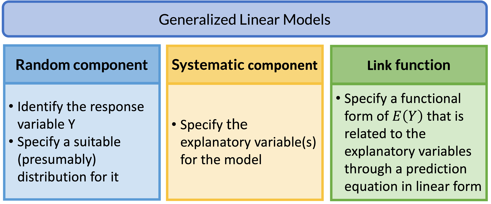

```{r}
#| echo: false
#| warning: false
#| message: false

library(tidyverse)
library(gt)
library(janitor)
library(rstatix)
library(knitr)
library(gtsummary)
library(moderndive)
library(broom) 
library(here) 
library(ggplot2)
library(ggpubr)

theme_set(theme_minimal() + 
            theme(text = element_text(size = 28)))
```

# Learning Objectives

1.  Review Generalized Linear Models and how we can branch to other types of regression.

2.  Identify outcome, examples, population model, and interpretations for different generalized linear models.

```{css, echo=FALSE}
.reveal code {
  max-height: 80% !important;
}
```

# Learning Objectives

::: lob
1.  Review Generalized Linear Models and how we can branch to other types of regression.
:::

2.  Identify outcome, examples, population model, and interpretations for different generalized linear models.

## Review: Generalized Linear Models (GLMs)



## GLM: Random Component {background-image="./images/title_blue.png" background-size="2500px 150px" background-position="top"}

-   The random component specifies the response variable $Y$ and selects a probability distribution for it

 

 

-   Basically, we are just identifying the distribution for our outcome

    -   If Y is [binary]{style="color:#F6C342; font-weight: bold;"}: assumes a [binomial]{style="color:#F6C342; font-weight: bold;"} distribution of Y

    -   If Y is [count]{style="color:#5B9BD5; font-weight: bold;"}: assumes [Poisson]{style="color:#5B9BD5; font-weight: bold;"} or negative binomial distribution of Y

    -   If Y is [continuous]{style="color:#70AD47; font-weight: bold;"}: assumea [Normal]{style="color:#70AD47; font-weight: bold;"} distribution of Y

## GLM: Systematic Component {background-image="./images/title_yell.png" background-size="2500px 150px" background-position="top"}

-   The systematic component specifies the explanatory variables, which enter linearly as predictors $$\beta_0+\beta_1X_1+\ldots+\beta_kX_k$$

 

-   Above equation includes:

    -   Centered variables
    -   Interactions
    -   Transformations of variables (like squares)

 

-   Systematic component is the **same** as what we learned in Linear Models

## GLM: Link Function {background-image="./images/title_green.png" background-size="2500px 150px" background-position="top"}

-   If $\mu = E(Y)$, then the link function specifies a function $g(.)$ that relates $\mu$ to the linear predictors as: $$g\left(\mu\right)=\beta_0+\beta_1X_1+\ldots+\beta_kX_k$$

    -   $g\left(\mu\right)$ is the transformation we make to $E(Y)$ (aka $\mu$) so that the linear predictors (right side of equation) can be linked to the outcome

-   The link function connects the random component with the systematic component

-   Can also think of this as: $$\mu=g^{-1}\left(\beta_0+\beta_1X_1+\ldots+\beta_kX_k\right)$$

- It's basically like saying $g\left(\mu\right)$ **IS** $\text{logit} (\mu)$ and thus $$ \text{logit} (\mu)=\beta_0+\beta_1X_1+\ldots+\beta_kX_k$$

## GLM: Link Function {background-image="./images/title_green.png" background-size="2500px 150px" background-position="top"}

| Dist'n of Y          | Typical uses                                               | Link name | Link function              | Common name                     |
|--------------|-----------------|--------------|--------------|--------------|
| Normal               | Linear-response data                                       | Identity  | $g(\mu)=\mu$               | Linear regression               |
| Bernoulli / Binomial | outcome of single yes/no occurrence                        | Logit     | $g(\mu)=\text{logit}(\mu)$ | Logistic regression             |
| Poisson              | count of occurrences in fixed amount of time/space         | Log       | $g(\mu)=\log(\mu)$         | Poisson regression              |
| Bernoulli / Binomial | outcome of single yes/no occurrence                        | Log       | $g(\mu)=\log(\mu)$         | Log-binomial regression         |
| Multinomial          | outcome of single occurence with K \> 2 options, *nominal* | Logit     | $g(\mu)=\text{logit}(\mu)$ | Multinomial logistic regression |
| Multinomial          | outcome of single occurence with K \> 2 options, *ordinal* | Logit     | $g(\mu)=\text{logit}(\mu)$ | Ordinal logistic regression     |


## Poll Everywhere Question 1

# Learning Objectives

1.  Review Generalized Linear Models and how we can branch to other types of regression.

::: lob
2.  Identify outcome, examples, population model, and interpretations for different generalized linear models.
:::

## Linear regression

::: columns
::: column
-   [**Outcome type:**]{style="color:#70AD47"} continuous

 

-   [**Example outcomes:**]{style="color:#5B9BD5"}
    -   Height
    -   IAT score
    -   Heart rate
:::

::: column
-   [**Population model**]{style="color:#ED7D31"} 

$$ E(Y \mid X) = \mu = \beta_0 + \beta_1 X$$

-   [**Interpretations**]{style="color:#D6295E"}
    -   The change in average $Y$ for every 1 unit increase in $X$
:::
:::

## Linear regression: Process for data analysis

::: box
{.absolute top="13.5%" right="62.1%" width="155"} {.absolute top="13.5%" right="28.4%" width="155"}{.absolute top="7.5%" right="30.5%" width="820"} {.absolute top="60.5%" right="48%" width="85"}

::: columns
::: {.column width="30%"}
::: RAP1
::: RAP1-title
Model Selection
:::

::: RAP1-cont
-   Building a model

-   Selecting variables

-   Prediction vs interpretation

-   Comparing potential models
:::
:::
:::

::: {.column width="4%"}
:::

::: {.column width="30%"}
::: RAP2
::: RAP2-title
Model Fitting
:::

::: RAP2-cont
-   Find best fit line

-   Using OLS in this class

-   Parameter estimation

-   Categorical covariates

-   Interactions
:::
:::
:::

::: {.column width="4%"}
:::

::: {.column width="30%"}
::: RAP3
::: RAP3-title
Model Evaluation
:::

::: RAP3-cont
-   Evaluation of model fit
-   Testing model assumptions
-   Residuals
-   Transformations
-   Influential points
-   Multicollinearity
:::
:::
:::
:::
:::

::: RAP4
::: RAP4-title
Model Use (Inference)
:::

::: RAP4-cont
::: columns
::: {.column width="50%"}
-   Inference for coefficients
-   Hypothesis testing for coefficients
:::

::: {.column width="50%"}
-   Inference for expected $Y$ given $X$
-   Prediction of new $Y$ given $X$
:::
:::
:::
:::


## Logistic regression

::: columns
::: column
-   [**Outcome type:**]{style="color:#70AD47"}  binary, yes or no

 

-   [**Example outcomes:**]{style="color:#5B9BD5"}
    -   Food insecurity
    -   Disease diagnosis for patient
    -   Fracture
:::

::: column
-   [**Population model**]{style="color:#ED7D31"} 

$$ \text{logit}(\mu) = \text{logit}(\pi(X)) = \beta_0 + \beta_1 X$$

-   [**Interpretations**]{style="color:#D6295E"}
    -   The log-odds ratio for every 1 unit increase in $X$
    -   $\text{exp}\big(\beta_1\big)$ is odds ratio for every 1 unit increase in $X$
:::
:::

## Logistic regression: Process for data analysis

::: box
{.absolute top="13.5%" right="62.1%" width="155"} {.absolute top="13.5%" right="28.4%" width="155"}{.absolute top="7.5%" right="30.5%" width="820"} {.absolute top="60.5%" right="48%" width="85"}

::: columns
::: {.column width="30%"}
::: RAP1
::: RAP1-title
Model Selection
:::

::: RAP1-cont
-   Build a model

-   Select variables

-   Prediction vs association

-   Comparing potential models
:::
:::
:::

::: {.column width="4%"}
:::

::: {.column width="30%"}
::: RAP2
::: RAP2-title
Model Fitting
:::

::: RAP2-cont
-   Find model that maximizes likelihood function

-   Parameter estimation (MLEs)

-   Categorical covariates

-   Interactions
:::
:::
:::

::: {.column width="4%"}
:::

::: {.column width="30%"}
::: RAP3
::: RAP3-title
Model Evaluation
:::

::: RAP3-cont
-   Evaluation of model fit
-   Check model assumptions
-   Transformations
-   Influential points
-   Multicollinearity
-   Overdispersion
:::
:::
:::
:::
:::

::: RAP4
::: RAP4-title
Model Use (Inference)
:::

::: RAP4-cont
::: columns
::: {.column width="50%"}
-   Inference for odds ratios
-   Hypothesis testing for odds ratios
:::

::: {.column width="50%"}
-   Inference for expected $\pi$ given $X$
-   Prediction of new $Y$ given $X$
:::
:::
:::
:::


## Log-binomial Regression

::: columns
::: column
-   [**Outcome type:**]{style="color:#70AD47"} binary, yes or no

 

-   [**Example outcomes:**]{style="color:#5B9BD5"}
    -   Food insecurity
    -   Disease diagnosis for patient
    -   Fracture
:::

::: column
-   [**Population model**]{style="color:#ED7D31"} 

$$ \log(\mu) = \text{log}(\pi(X)) = \beta_0 + \beta_1 X$$

-   [**Interpretations**]{style="color:#D6295E"}
    -   We have log of probability on the left
    -   So exponential of our coefficients will be **risk ratio**
:::
:::

## Poisson Regression

::: columns
::: column
-   [**Outcome type:**]{style="color:#70AD47"} Counts or rates

 

-   [**Example outcomes:**]{style="color:#5B9BD5"}
    -   Number of children in household
    -   Number of hospital admissions
    -   Rate of incidence for COVID in US counties
:::

::: column
-   [**Population model**]{style="color:#ED7D31"} 

$$ \log(\mu) = \log(\lambda) = \beta_0 + \beta_1 X$$

-   [**Interpretations**]{style="color:#D6295E"}
    -   The count (or rate) ratio for every 1 unit increase in $X$
:::
:::

## Multinomial logistic regression

::: columns
::: column
-   [**Outcome type:**]{style="color:#70AD47"} multi-level categorical, no inherent order

 

-   [**Example outcomes:**]{style="color:#5B9BD5"}
    -   Blood type
    -   US region (from WBNS)
    -   Primary site of lung cancer (upper lobe, lower lobe, overlapped, etc.)
-   We have additional restriction that the multiple group probabilities sum to 1
:::

::: column
-   [**Population models**]{style="color:#ED7D31"}$$ \log \left(\dfrac{\mu_{\text{group } 2}}{\mu_{\text{group } 1}} \right) = \beta_0 + \beta_1 X$$ $$ \log \left(\dfrac{\mu_{\text{group } 3}}{\mu_{\text{group } 1}} \right) = \beta_0 + \beta_1 X$$

-   [**Interpretations**]{style="color:#D6295E"}

    -   Basically fitting two binary logistic regressions at same time!
    -   First equation: how a one unit change in $X$ changes the log-odds of going from group 1 to group 2
    -   Second equation: how a one unit change in $X$ changes the log-odds of going from group 1 to group 3
:::
:::

## Ordinal logistic regression

::: columns
::: column
-   [**Outcome type:**]{style="color:#70AD47"} multi-level categorical, with inherent order
-   [**Example outcomes:**]{style="color:#5B9BD5"}
    -   Satisfaction level (likert scale)
    -   Pain level
    -   Stages of cancer
    
 
    
-   When these variables are predictors, we are pretty lenient about treating them as continuous
    -   We must be VERY STRICT when they are outcomes
    -   They do not meet the assumptions we place on continuous outcomes in linear regression!!
-   We have additional restriction that the multiple group probabilities sum to 1
:::

::: column
-   [**Population models**]{style="color:#ED7D31"} , with levels $k = 1, 2, 3, ..., K$

$$ \log \left(\dfrac{P(Y \leq 1)}{P(Y > 1)} \right) = \beta_0 + \beta_1 X$$ $$ \log \left(\dfrac{P(Y \leq k)}{P(Y > k)} \right) = \beta_0 + \beta_1 X$$

-   [**Interpretations**]{style="color:#D6295E"}
    -   Basically fitting $K$ binary logistic regressions at same time!
    -   First equation: how a one unit change in $X$ changes the log-odds of going from group 1 to any other group
    -   Second equation: how a one unit change in $X$ changes the log-odds of going from group 1 or 2 to group 3 or above
:::
:::

## Resources {.smaller}

::: columns

::: column

### Linear regression resources

-   512/612 class site!!
-   [Online textbook by Dr. Nahhas](https://www.bookdown.org/rwnahhas/RMPH/mlr.html)

### Logistic regression resources

-   [Online textbook by Dr. Nahhas](https://www.bookdown.org/rwnahhas/RMPH/blr.html)

### Log-binomial Regression resources

-   [Online textbook by Dr. Nahhas](https://www.bookdown.org/rwnahhas/RMPH/blr-log-binomial.html)
-   [Article on `logbin` package that is used to fit log-binomial regression](https://www.jstatsoft.org/article/view/v086i09)

### Ordinal logistic regression resources

-   [Online textbook by Dr. Nahhas](https://www.bookdown.org/rwnahhas/RMPH/blr-ordinal.html)
-   [Online textbook by Dr. Werth with data and R script](https://bookdown.org/sarahwerth2024/CategoricalBook/ordinal-logistic-regression-r.html#lab-overview-15)

:::
::: column

### Poisson Regression resources

-   [PennState 504 website](https://online.stat.psu.edu/stat504/lesson/9)

-   [Online textbook by Dr. Nahhas](https://bookdown.org/roback/bookdown-BeyondMLR/ch-poissonreg.html)

-   [YouTube video on R tutorial for Poisson Regression](https://www.youtube.com/watch?v=QPY4zuxs1W0&ab_channel=StatisticsGuideswithProfPaulChristiansen)

    -   Dr. Fogerty is a professor in Political Science, so just beware they may not have formal statistical training

-   [Guided R tutorial page on Poisson regression](https://rpubs.com/Julian_Sampedro/1047952)

-   [Online textbook by Dr. Werth](https://bookdown.org/sarahwerth2024/CategoricalBook/count-regression-r.html)

    -   Social scientist, so just beware they may not have formal statistical training

### Multinomial logistic regression resources

-   [YouTube video on R tutorial for Poisson Regression](https://www.youtube.com/watch?v=kn9hfk-Xxdo&list=PLyl6DBKlvopBOk_eW1Uin8lsY4ixWxd4E&index=12&ab_channel=QuantitativeSocialScienceDataAnalysis)

    -   Again, Dr. Fogerty is a professor in Political Science

-   [R-bloggers post with guided R code](https://www.r-bloggers.com/2020/05/multinomial-logistic-regression-with-r/)

-   [Online textbook by Dr. Werth with data and R script](https://bookdown.org/sarahwerth2024/CategoricalBook/multinomial-logit-regression-r.html)

:::
:::

## Even more regressions...

| Dist'n of Y          | Typical uses                                               | Link name             | Link function               | Common name                      |
|---------------|---------------|---------------|---------------|---------------|
| Bernoulli / Binomial | outcome of single yes/no occurrence                        | Probit                | $g(\mu)=\Phi^{-1}(\mu)$     | Probit regression                |
| Bernoulli / Binomial | outcome of single yes/no occurrence                        | Complementary log-log | $g(\mu)=\log(-\log(1-\mu))$ | Complementary log-log regression |
| Multinomial          | outcome of single occurence with K \> 2 options, *nominal* | Probit                | $g(\mu)=\Phi^{-1}(\mu)$     | Multinomial probit regression    |
| Multinomial          | outcome of single occurence with K \> 2 options, *ordinal* | Probit                | $g(\mu)=\Phi^{-1}(\mu)$     | Ordered probit regression        |

## More regression resources

-   [Probit regression](https://bookdown.org/sarahwerth2024/CategoricalBook/probit-regression-r.html)

-   [Complementary log-log](https://towardsdatascience.com/a-gentle-introduction-to-complementary-log-log-regression-8ac3c5c1cd83)

-   [Multinomial probit](https://www.youtube.com/watch?v=MsYYOjX_TWY&ab_channel=QuantitativeSocialScienceDataAnalysis)

-   [Ordered probit](https://www.youtube.com/watch?v=kI5PgqzSMzs&ab_channel=QuantitativeSocialScienceDataAnalysis)

## General resources

-   [Dr. Fogerty's YouTube series](https://www.youtube.com/playlist?list=PLyl6DBKlvopBOk_eW1Uin8lsY4ixWxd4E)

-   [Dr. Werth's Categorical Book](https://bookdown.org/sarahwerth2024/CategoricalBook/)

-   [Dr. Nahhas' Book](https://www.bookdown.org/rwnahhas/RMPH/)

-   [The Epidemiologist R Handbook](https://epirhandbook.com/en/index.html)

    -   Analysis AND R work