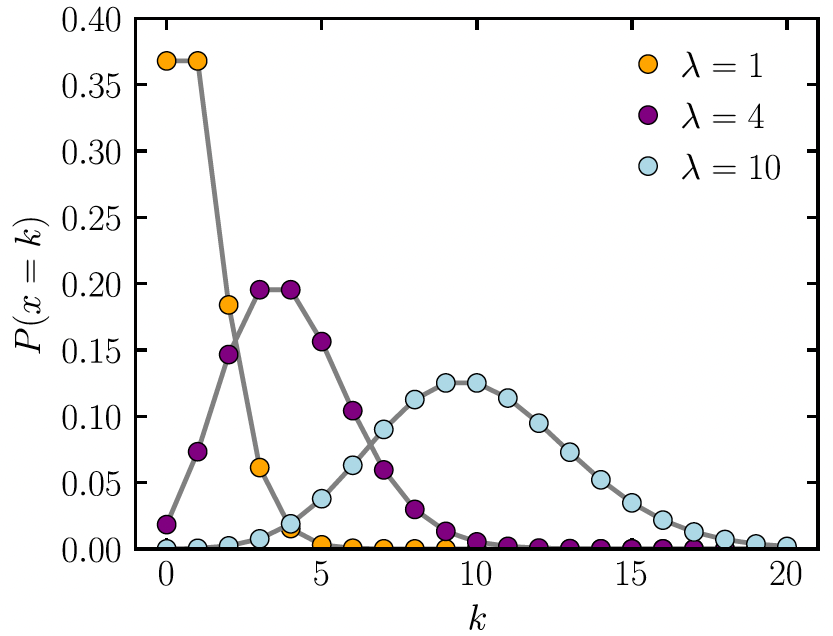

```{r}
#| echo: false
#| warning: false
#| message: false

library(tidyverse)
library(gt)
library(janitor)
library(rstatix)
library(knitr)
library(gtsummary)
library(moderndive)
library(broom) 
library(here) 
library(ggplot2)
library(ggpubr)

theme_set(theme_minimal() + 
            theme(text = element_text(size = 28)))
```

# Learning Objectives

2.  Understand what we can measure with Poisson regression and how to interpret coefficients.

3.  Understand how to adjust for different follow-up times among individuals

```{css, echo=FALSE}
.reveal code {
  max-height: 80% !important;
}
```


# Learning Objectives

::: lob
1.  Understand what we can measure with Poisson regression and how to interpret coefficients.
:::

2.  Understand how to adjust for different follow-up times among individuals

## From Lesson 15: Poisson Regression

::: columns
::: column
-   [**Outcome type:**]{style="color:#70AD47"} Counts or rates

 

-   [**Example outcomes:**]{style="color:#5B9BD5"}
    -   Number of children in household
    -   Number of hospital admissions
    -   Rate of incidence for COVID in US counties
:::

::: column
-   [**Population model**]{style="color:#ED7D31"} 

$$ \log(\mu) = \log(\lambda) = \beta_0 + \beta_1 X$$

-   [**Interpretations**]{style="color:#D6295E"}
    -   The count (or rate) ratio for every 1 unit increase in $X$
:::
:::

## Modeling with a Poisson Distribution

- Observations in Poisson regression will have counts of events 
  - Might be counting a binary event, but each observation can have a count > 1

::: columns
::: column

::: theorem
::: thm-title
Count data modeled as Poisson distribution
:::
::: thm-cont
-   This distribution is often used to model [**count data**]{style="color:#70AD47"}
-   Examples:
    -   Distribution of number of deaths due to lung cancer
    -   Distribution of number of individuals diagnosed with leukemia
    -   Distribution of number of hospitalizations
:::
:::
:::

::: column
::: definition
::: def-title
Rate data modeled as Poisson distribution
:::
::: def-cont
-   This distribution is often used to model [**rate data**]{style="color:#5B9BD5"}
    - With time as a big component
-   Examples:
    -   Distribution of number of deaths due to lung cancer **per year**
    -   Distribution of number of individuals diagnosed with leukemia **over follow-up time**
    -   Distribution of number of hospitalizations **per day**
:::
:::
:::
:::

## Example 1: Horseshoe Crabs and Satellites

::: columns
::: column
Example of [**count data**]{style="color:#70AD47"}:

Each female horseshoe crab in the study had a male crab attached to her in her nest. The study investigated factors that affect whether the female crab had any other males, called satellites, residing near her. Explanatory variables that are thought to affect this included the female crab's color, spine condition, and carapace width, and weight. The response outcome for each female crab is the number of satellites. There are 173 females in this study.

{width="400" fig-align="center"}
:::

::: column

```{r}
library(rsq)
data(hcrabs)
ggplot(data = hcrabs) + 
  geom_bar(aes(x = num.satellites)) +
  xlab("Number of satellites")
```
:::
:::

## Poisson Distribution with a count

::: columns
::: column
-   The probability function of Poisson distribution: $$P(Y = y | \mu) = \dfrac{\mu^y e^{-\mu}}{y!}$$
    -   Where $y$'s are non-negative integers $y=0, 1, 2,...$
    -   Where $\mu$ is the mean of $Y$, that is $E(Y)=\mu$
    -   And also, $\text{var}(Y)=\mu$
-   For a Poisson distribution, $Y \sim \text{Poisson}(\mu)$
    -   Range: $[0, \infty)$
:::

::: column
[From Wikipedia:](https://en.wikipedia.org/wiki/Poisson_distribution)


:::
:::

## Poll Everywhere Question 1

## Example 2: Lung Cancer Incidence

Example of [**rate data**]{style="color:#5B9BD5"}:

We can look at the lung cancer incident counts (cases) per age group for four Danish cities from 1968 to 1971. Since it's reasonable to assume that the expected count of lung cancer incidents is proportional to the population size, we would prefer to model the rate of incidents per capita.

 

```{r}
library(ISwR)
data(eba1977)
lc_inc = eba1977 %>% mutate(lpop = log(pop))
```

## Poisson Distribution with a rate

-   If we look at the probability of $y$ events **in a time period or in a population** $t$ for a Poisson random variable, we could write: $$P(Y = y | \mu) = \dfrac{\mu^y e^{-\mu}}{y!} = \dfrac{(\lambda t)^y e^{-\lambda t}}{y!}$$
    -   Where $y$'s are non-negative integers $y=0, 1, 2,...$
    -   Where $\mu = \lambda t$, where $\lambda$ is the expected number of events per unit time (aka **rate**) OR per capita (per person)
        - $\lambda t$: rate $\times$ time
        - $\lambda t$: rate $\times$ population
    -   Then $\mu$ is the expected number of events over time $t$ or over population $t$

## What does $\lambda$ represent in the Poisson distribution?

-   What does $\lambda$ represent?
    -   A rate, the expected number of events in a given population over a given period time

 

-   Example: Number of patient arrivals into the Emergency Room per hour
-   Example: Number of individuals with positive COVID test in a county per capita

 

-   The Poisson distribution is the prototype for assigning probabilities of observing any number of events

## Review: Simple Logistic Regression

-   Let Y is the dependent variable of interest and x is a predictor variable,
    -   In simple logistic regression, we have $$\log\left(\frac{\pi(X)}{1 - \pi(X)}\right) = \beta_0 + \beta_1 X$$
    -   where $\pi (X) =P(Y = 1 \mid X = x)$

## Simple Poisson Regression Model

-   What do we model in a Poisson regression?

 

-   Log of conditional mean of $Y$ given $X$
    -   Conditional mean of $Y$ given $X$ is represented as $E(Y \mid X) = \mu(X)$
    -   Let $Y$ be a Poisson count **for a given unit of time or per capita**, then $\mu(X) =\lambda(X)$
    -   In a simple Poisson regression, we have

$$\ln(\mu(X)) = \ln(\lambda(X)) = \beta_0 + \beta_1 X$$

 

-   So this is also called a **log-linear model**

## Poisson model assumptions

- Count or rate response
  - The response variable is a count (non-negative integers)
  - It is suitable for grouped or ungrouped data since the sum of Poisson distributed observations is also Poisson
    - Grouped by time or by capita

- Independent events
  - The counts, i.e. the events, are assumed to be independent of each other

- Variance is same as mean 
  - By definition of the Poisson distribution, the variance is assumed to be equal to the mean 
  - When this assumption does not hold, we should consider a Quasipoisson GLM for overdispersed (or underdispersed) data or a Negative Binomial GLM instead

 

- The text above was largely pulled [from this tutorial on Poisson regression](https://rpubs.com/Julian_Sampedro/1047952)

## Parameter Interpretation: Binary $X$ (1/2)

-   In simple Poisson regression: $$\ln(\mu(X)) = \ln(\lambda(X)) = \beta_0 + \beta_1 X$$

-   When $X$ is a binary variable: How do we interpret $\beta_1$?

    -   When $X=0$: $$\ln(\mu(X = 0)) = \beta_0 + \beta_1 \cdot 0 = \beta_0$$
        -   $\mu(X = 0) = \exp (\beta_0)$: the mean count or rate of $Y$ when $X=0$
    -   When $X=1$: $$\ln(\mu(X = 1)) = \beta_0 + \beta_1 \cdot 1 = \beta_0 + \beta_1$$
        -   $\mu(X = 1) = \exp (\beta_0 + \beta_1)$: the mean count or rate of $Y$ when $X=1$

## Parameter Interpretation: Binary $X$ (2/2)

-   When $X$ is a binary variable: How do we interpret $\beta_1$?
    -   By subtraction, we have $$\beta_1 = \beta_0 + \beta_1 - (\beta_0) = \ln(\mu(X = 1)) -  \ln(\mu(X = 0)) = \ln \left( \dfrac{\mu(X = 1)}{\mu(X = 0)} \right)$$

    -   $\beta_1$: log-count ratio or log-rate ratio

        -   Since $\mu(X)$ is $\lambda(X)$ is the rate of $Y$

    -   So $\exp(\beta_1)$ is the count or rate ratio comparing $X=1$ to $X=0$

## Parameter Interpretation: Continuous $X$

-   When $X$ is a continuous variable: How do we interpret $\beta_0$?

    -   $\beta_0$: log-count or log-rate when $X$ is 0

    -   So $\exp(\beta_0)$ is the expected count or rate when $X$ is 0

-   When $X$ is a continuous variable: How do we interpret $\beta_1$?

    -   $\beta_1$: log-count ratio or log-rate ratio for every 1 unit increase in $X$
        -   Since $\mu(X)$ is $\lambda(X)$ is the rate of $Y$
    -   So $\exp(\beta_1)$ is the rate ratio for every 1 unit increase in $X$

## Example 1: Horseshoe Crabs and Satellites

::: columns
::: column
```{r}
ggplot(hcrabs, 
       aes(x=width, 
           y=num.satellites)) + 
  geom_point(size = 2)
```
:::

::: column
```{r}
crab_mod = glm(num.satellites ~ width, 
                family=poisson, 
                data=hcrabs)
tidy(crab_mod, conf.int=T, 
     exponentiate=T) %>% 
  gt() %>% 
  tab_options(table.font.size = 35) %>%
  fmt_number(decimals = 2)
```
:::
:::

Interpretation: For every 1-cm increase in carapace width, the expected number of satellites increases by 18% (95% CI: 13%, 23%).

## Example 2: Lung Cancer Incidence

::: columns
::: column
```{r}
#| fig-width: 10
#| fig-height: 7

ggplot(lc_inc, aes(x=age, y=cases, 
           color = city)) + 
  geom_point(size = 2)
```
:::

::: column
```{r}
lc_mod = glm(cases ~ city + age, 
            offset=lpop, 
            family=poisson, 
            data=lc_inc)
```

```{r}
#| code-fold: true
#| code-summary: "Regression table"
tidy(lc_mod, conf.int=T, 
     exponentiate=T) %>% 
  gt() %>% 
  tab_options(table.font.size = 30) %>%
  fmt_number(decimals = 3)
```
:::
:::

## Poll Everywhere Question 2

# Learning Objectives

1.  Understand what we can measure with Poisson regression and how to interpret coefficients.

::: lob
2.  Understand how to adjust for different follow-up times among individuals
:::

## Building towards person-years

-   In an example of number of patient arrivals, an event does not conclude the study
    -   If someone arrives within the first minute of the study, then we keep counting
    -   We may be able to study the association of arrivals with qualities of the hospital, but we can’t measure qualities of the individuals arriving

 

-   For example, in the lung cancer study, we can only discuss the incidence of cancer at the city-wide level

 

-   What happens if we want to measure qualities of the individual?
    -   We can measure a hospitalization rate

## Why Person-Years?

-   If we are measuring at the individual level and counting something that is "terminal" then our count will always be 0 or 1
    -   Example: Number of individuals diagnosed with leukemia
    -   This only happens once, so how do we measure the rate here?

 

-   Since rate involves the counts and time – we can use the time to diagnosis to estimate the rate
    -   Often expressed in units such as events per thousand person-years

 

-   Person-years allow us to follow individuals for different amounts of time

## What is a Person-Year and how to calculate?

-   One person-year is a unit of time defined as one person being followed for one year

 

-   Person-years for a sample of n subjects is calculated as the total years followed for the n subjects, where each subject could have different follow-up time

 

-   Example: suppose we have 5 subjects, two of the subjects were followed for 2 years, and two of them are followed for 3 years and the fifth subject was followed for 3.8 years

$$\text{person-years} = 2 \text{ people} \cdot 2 \text{ years} +2 \text{ people} \cdot 3 \text{ years}+ 1 \text{ person} \cdot 3.8 \text{ years} = 13.8 \text{ person-years}$$

## Calculating Rate

-   Suppose that we observe one event during the follow-up period, then

$$\begin{aligned}
\text{Rate of event} &= \dfrac{\# events}{\text{person-years}}= \dfrac{1 \text{ event}}{13.8 \text{person-years}} \\ &= 0.072 \text{ events per person−year} \\ &=72 \text{ events per } 1000 \text{ person−years} \end{aligned}$$

-   Now our rate of event is measured per person-year

    -   Often use 1000 person-years to count the events with whole numbers

## Including an offset when we have different follow-up times

-   What if we have data that each observation has different period of time?

    -   For example, we look at number of ED visits when subjects are enrolled in Oregon Health Plan, however, each subjects are enrolled in the plan for different length of time…
    -   How do we incorporate this different length of time?

-   Note we have: $\mu = \lambda t$ and with predictor $X$, $\mu(X) = \lambda(X) \cdot t(X)$

    -   $t$ is now a function of the individual, represented with $X$

-   Then we construct:

$$\begin{aligned} \ln(\lambda(X)) = & \beta_0 + \beta_1 X \\
\ln(\lambda(X)) = \ln\left(\dfrac{\mu(X)}{t(X)}\right) = \ln(\mu(X)) - \ln(t(X)) = &\beta_0 + \beta_1 X \\
\ln(\mu(X)) = & \ln(t(X)) + \beta_0 + \beta_1 X\\ \end{aligned}$$

## Including an offset when we have different follow-up times

-   That is, to incorporate the different lengths in the model,

$$\ln(\mu(X)) =  \ln(t(X)) + \beta_0 + \beta_1 X$$

-   We have one more term in the model and this term is called **offset**, a known term in the model since $t(X)$ is known for each individual

-   $\ln(t(X))$ is called the offset

-   Offsets can also be something like the population size in a city...

## Example 2: Lung Cancer Incidence

```{r}
lc_mod = glm(cases ~ city + age, offset=lpop, family=poisson, data=lc_inc)
summary(lc_mod)
```

## Further reading / tutorials on Poisson regression

-   [Good tutorial in R](https://www.dataquest.io/blog/tutorial-poisson-regression-in-r/)

- [Another good tutorial that includes overdispersion](https://rpubs.com/Julian_Sampedro/1047952)

- [Comparison between Poisson and log-binomial regressions](https://pmc.ncbi.nlm.nih.gov/articles/PMC2292207/)

-   When people are followed for different amounts of time, we should include an offset

    -   Poisson Regression Modeling Using Rate Data: section from above site that discusses offsets

-   We can use Wald test and LRT in the same way as logistic regression to test our coefficients and variables
