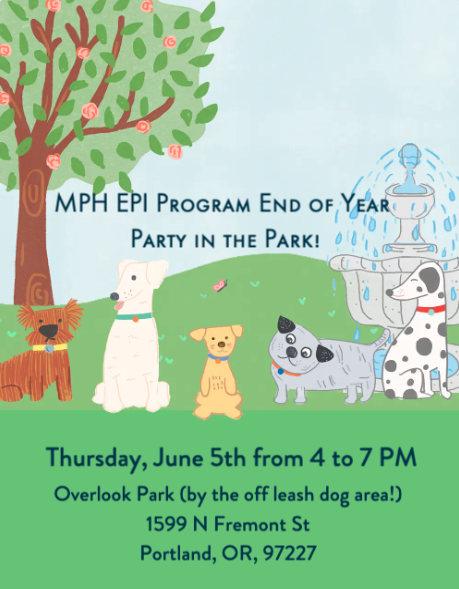

## Announcements

- Epi end of year party tomorrow: 
- Poster session on 6/9
  - Poster session will be in VPT 515 1-2:50pm
  - We will set up posters from 1-1:15pm 
  - Time to eat and be merry until ~1:30pm, then we will start meandering around posters
  - Posters need to be printed before 1pm
  - There is a color printer on the 5th floor in the cubicles across from the 510 offices. This is the area near the 515 classroom that faces North.
  - I will bring the main dish (maybe pizza, but I'm open to other ideas).
    - Dietary restrictions question in 6/4 exit ticket. Please fill out!!
    - Feel free to bring more food!
  - I will have a few slides today (6/4) to discuss posters
  - If you did purposeful model selection, make sure you have a structured way to interpret interactions and main effects that involve interactions! (See Quiz 3 note)
- Quiz 3
  - Just finished grading!
  - Please make sure you can see your answers, the correct answer, and my comments to you.
  - Please revisit the last question on interpreting an odds ratio when there is an interaction! If you did purposeful model selection in your poster, you will need to interpret all odds ratios correctly!
- Have you received the course feedback form yet?
  - Please fill it out!
  - It is one of the main components of my promotion 
    - So if you enjoyed the course, felt meh about it, or hated it, please fill it out!
  - Reminder for all course evals: these evals go directly to our supervisors
- Please check your grades in Sakai!!
  - Do you have a 0 for a HW that you thought you turned in?
  - Do you have a 0 for an exit ticket that you thought you did?
  - Lab attendance/make-up?

## Key Dates

- Poster session on 6/9
- Poster submission on 6/9 at 11pm!

